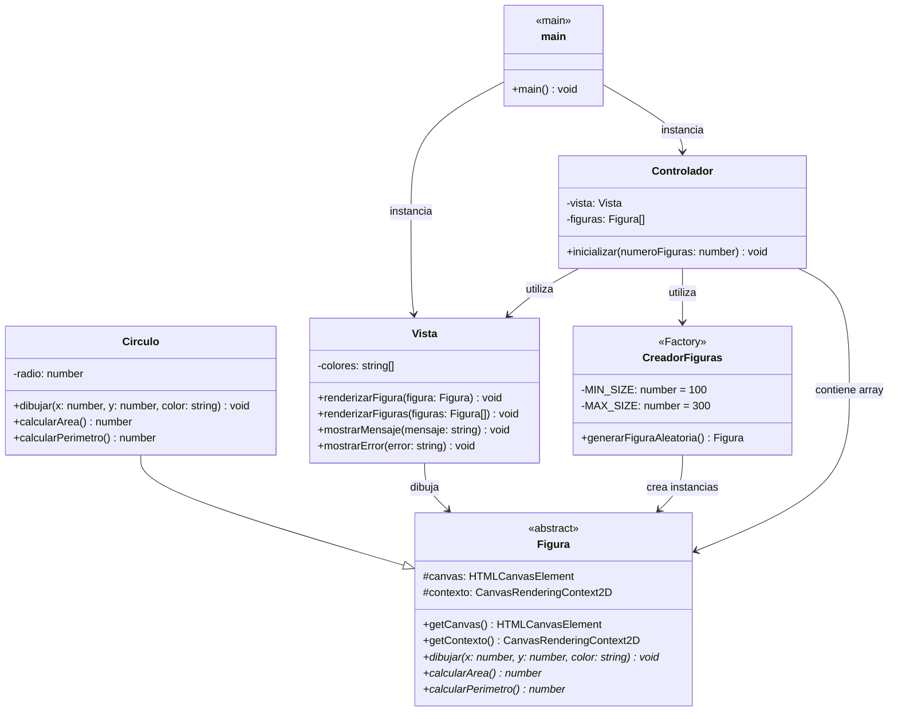

# Diagrama UML - Visualización de Figuras

```mermaid
classDiagram
    %% Modelo
    class Figura {
        <<abstract>>
        #canvas: HTMLCanvasElement
        #contexto: CanvasRenderingContext2D
        +getCanvas() HTMLCanvasElement
        +getContexto() CanvasRenderingContext2D
        +dibujar(x: number, y: number, color: string)* void
        +calcularArea()* number
        +calcularPerimetro()* number
    }

    class Circulo {
        -radio: number
        +dibujar(x: number, y: number, color: string) void
        +calcularArea() number
        +calcularPerimetro() number
    }

    class CreadorFiguras {
        <<Factory>>
        -MIN_SIZE: number = 100
        -MAX_SIZE: number = 300
        +generarFiguraAleatoria() Figura
    }

    %% Vista
    class Vista {
        -colores: string[]
        +renderizarFigura(figura: Figura) void
        +renderizarFiguras(figuras: Figura[]) void
        +mostrarMensaje(mensaje: string) void
        +mostrarError(error: string) void
    }

    %% Controlador
    class Controlador {
        -vista: Vista
        -figuras: Figura[]
        +inicializar(numeroFiguras: number) void
    }

    %% Cliente
    class main {
        <<main>>
        +main() void
    }

    %% Herencia
    Circulo --|> Figura

    %% Composición y Uso
    Controlador --> Vista : utiliza
    Controlador --> CreadorFiguras : utiliza
    Controlador --> Figura : contiene array
    Vista --> Figura : dibuja
    main --> Vista : instancia
    main --> Controlador : instancia
    CreadorFiguras --> Figura : crea instancias
```