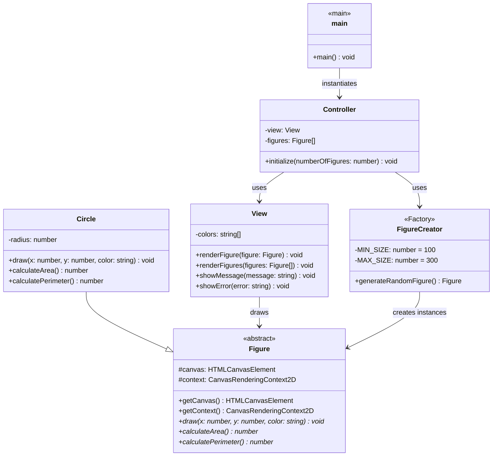

```mermaid
classDiagram
    
    class Figure {
        <<abstract>>
        #canvas: HTMLCanvasElement
        #context: CanvasRenderingContext2D
        +getCanvas() HTMLCanvasElement
        +getContext() CanvasRenderingContext2D
        +draw(x: number, y: number, color: string)* void
        +calculateArea()* number
        +calculatePerimeter()* number
    }

    class Circle {
        -radius: number
        +draw(x: number, y: number, color: string) void
        +calculateArea() number
        +calculatePerimeter() number
    }

    class FigureCreator {
        <<Factory>>
        -MIN_SIZE: number = 100
        -MAX_SIZE: number = 300
        +generateRandomFigure() Figure
    }

    
    class View {
        -colors: string[]
        +renderFigure(figure: Figure) void
        +renderFigures(figures: Figure[]) void
        +showMessage(message: string) void
        +showError(error: string) void
    }

    class Controller {
        -view: View
        -figures: Figure[]
        +initialize(numberOfFigures: number) void
    }

    class main {
        <<main>>
        +main() void
    }

    Circle --|> Figure

    Controller --> View : uses
    Controller --> FigureCreator : uses
    View --> Figure : draws
    main --> Controller : instantiates
    FigureCreator --> Figure : creates instances
```